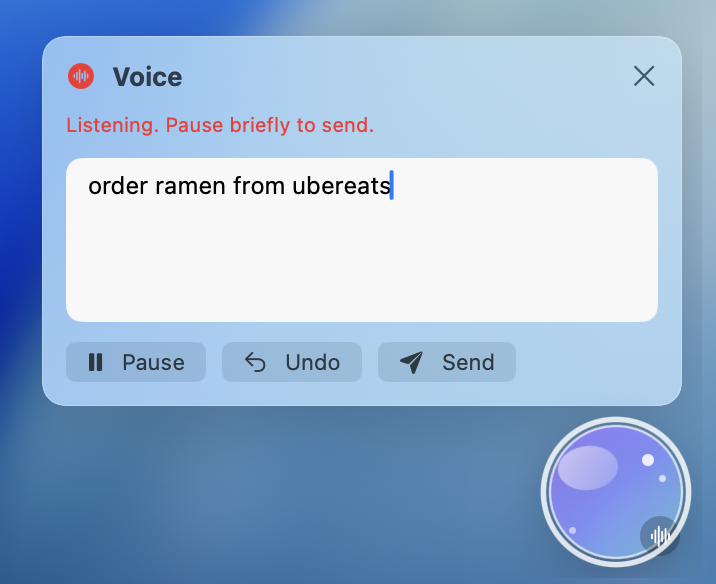
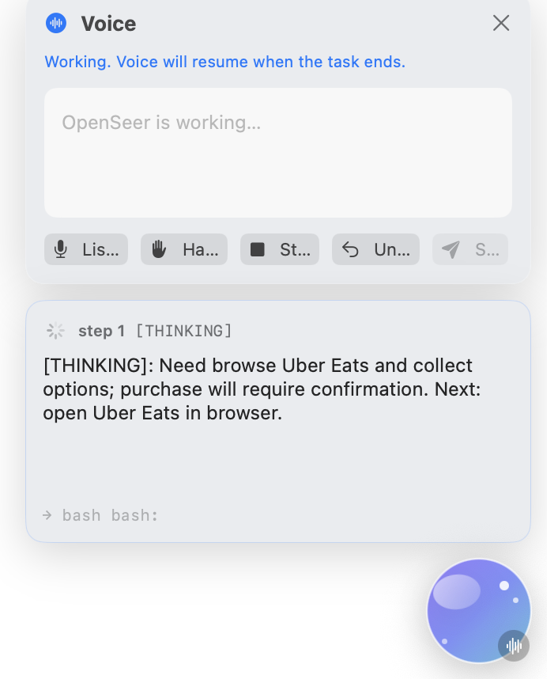

# OpenSeer

**The next-generation Siri Apple promised — open-source, local-first,
shipping today.** Press a hotkey, talk to your Mac, watch it drive
your apps across windows. Runs locally with your own LLM provider,
remembers what it learns, and gets better at the sites and apps you
use the most.

**Pre-alpha.** Working internals, reckless edges. It will literally
take over your mouse and keyboard.

> 💡 **The best experience is typeless + OpenSeer.** Flip *Voice* on
> in Settings → General → Voice, then press `⌘⌥S` and just talk —
> the orb listens, sends on a brief pause, and the agent drives the
> rest. Voice is opt-in (off by default) so a fresh install doesn't
> trip on microphone / Speech Recognition permissions before you've
> chosen to use them.

Press `⌘⌥S` from anywhere and the orb floats in with the mic on:

<p align="center">
  
</p>

Hit Send (or just pause briefly). The mic shuts off so ambient
noise doesn't barge in, the orb shows its current step inline, and
you can take over at any time with **Hand off** or **Stop**:

<p align="center">
  
</p>

Press `⌘⌥S` again to dismiss the orb entirely — no invisible
recording, no leftover panel.

## The Siri Apple Intelligence promised

The WWDC 2024 pitch for the next Siri was:

- Awareness of what's on your screen.
- Cross-app action — chain things together without you tab-hopping.
- Personal context — knows your stuff, your history, your habits.
- Real multi-step tasks instead of one-shot commands.

That Siri has been delayed twice and counting. OpenSeer is what
that demo looked like, running on your Mac today:

- **On-screen awareness** — every turn dumps the foreground app's
  accessibility tree, so the agent clicks "the third row" by *name*
  and *role*, not pixel-guessing from a screenshot.
- **Cross-app, multi-step** — open one app, click through a flow on
  another, run a shell command, fetch a page, hand back the result.
  It chains.
- **Personal context that compounds** — a `MEMORY.md` of things
  you've confirmed (default payment, addresses, preferences) +
  per-site / per-app skill cheat-sheets that *grow themselves* from
  what worked the last few times you tried something.
- **Honest about what it did** — every step records the screenshot
  the model saw, the thought it had, the action it took, and the
  result. You can inspect, replay, or hand off mid-run.
- **Open source, your provider, your machine** — no Apple silicon
  requirement, no Apple cloud, no waiting for a keynote.

## Install

### macOS app (recommended)

Download `OpenSeer-x.y.z.dmg` from the
[Releases](https://github.com/TobyGE/OpenSeer/releases) page, drag
`OpenSeer.app` into `/Applications`, launch it once, and complete
the OAuth + Privacy prompts that the in-app setup wizard walks you
through. The bundle ships its own Python; nothing to install
separately.

If macOS won't open it ("unidentified developer" — we're not
notarized yet), right-click → Open the first time, or:

```bash
xattr -d com.apple.quarantine /Applications/OpenSeer.app
```

### From source

```bash
git clone https://github.com/TobyGE/OpenSeer.git
cd OpenSeer
pip install -e .

openseer setup        # pick provider, OAuth, grant macOS perms
openseer              # drop into the chat shell
```

`setup` detects existing provider logins and runs OAuth for
whichever you're missing. Your choice persists to
`~/.openseer/config.json`; override with `OPENSEER_PROVIDER=…`.

## How you talk to it

- **`⌘⌥S` from anywhere on the system** — a crystal-ball window
  appears at the bottom-right of your screen with the mic on,
  listening. Press the same hotkey again to dismiss it entirely
  (panel hidden, mic silenced — no invisible recording). The orb
  captures whatever app you were just looking at, so *"summarize
  this"* / *"fix this"* / *"find me…"* knows what *this* refers to.
- **Speak or type** — voice is the headline path; the orb also has
  a text field with proper IME support so you can edit recognition
  errors before sending, or just type Chinese / Japanese / Korean
  with the full candidate popup.
- **Hand off mid-run** — pause the agent between steps to take the
  mouse yourself for a few moves, then resume; the agent re-reads
  state and continues from where you left it.
- **Barge in** — once a task is running the mic stays off so
  ambient talk doesn't auto-submit. Hit **Listen** to re-engage,
  speak the correction, and the new utterance cancels the running
  task and starts a fresh one with the prior progress in the
  session context.
- **Main chat window** — full history of every task, click into any
  past run to see steps, thoughts, screenshots.
- **From your phone** — `openseer daemon` exposes the same agent
  to Telegram with per-chat memory, live progress (ack edits every
  ~2.5s), and image attachments back to your phone. Fail-closed
  allowlist.

## What it can do

- **Drive any Mac app or website** — clicks, types, scrolls, keys,
  opens apps. Uses the native macOS Accessibility tree so it
  identifies elements by their actual labels and indexes them,
  instead of pixel-guessing from a screenshot. The AX wrapper is
  also published as a standalone
  [`openseer_ax`](./openseer_ax) package for other macOS
  automation projects.
- **Read pages** — `read_page` pulls a webpage's full text in one
  call, no scroll-and-screenshot loops.
- **Bash + web** — runs shell commands, fetches URLs, web search.
  The agent picks the right tool itself.
- **Skills that grow themselves** — per-site / per-app markdown
  cheat-sheets. After every task, OpenSeer looks at what you just
  did *plus the last few runs on the same site or app*, and
  proposes a *"Learned something — save as a skill?"* chip in the
  chat thread whenever a pattern recurs. One click to save; next
  time you ask for the same thing, the agent skips the detour.
- **Background clicks** — `CGEventPostToPid` routes clicks to the
  target app without stealing your cursor, so you can keep working
  while the agent does its thing.
- **MCP server** — `openseer mcp serve` exposes OpenSeer's
  primitives (screenshot, click, type, key, scroll, open_app,
  get_app_state) to any MCP-compatible host so other coding
  assistants can drive macOS through OpenSeer.
- **Honest reflection** — every step begins with a tag
  (`[SUCCESS]` / `[INEFFECTIVE]` / `[REGRESSED]` / `[THINKING]`)
  that the agent uses to self-correct before deciding the next
  move.
- **Safety nets** — `--confirm-each`, bash danger regex,
  `write_skill` body preview confirm, terminal-AX blacklist.
- **Full trace** — per-step screenshots, AX tree, raw response,
  SSE events, `transcript.json`, `trace.md`. Everything's on disk
  for replay or debugging.

## Contributing

```bash
git config core.hooksPath .githooks
```

`pre-push` runs `codex review` against pushed commits (advisory).
Set `OPENSEER_SKIP_REVIEW=1` to skip.

## License

Apache 2.0. See [LICENSE](./LICENSE).
